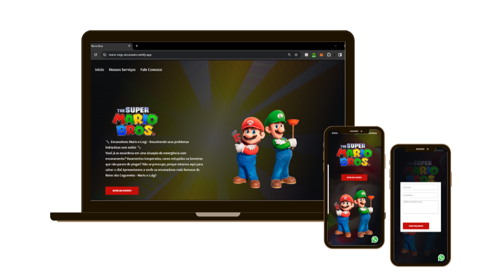

# Projeto Mario


## 📖 Sobre o Projeto 
Esse foi um projeto que aprendi no <a href="https://rodolfomori.com.br/devclub" target="_blank">DevClub</a>. É um site com um formulário funcional, usado para a coleta de informações dos clientes que efetuam o cadastro. Além disso, o site é responsivo.
 
## 🚀 Tecnologias Utilizadas
<div style="display: inline_block">
<p>HTML</p>
<p>CSS</p>
<p>JavaScript</p>
</div>


## 📥 Instalação

Clone o repositório e instale as dependências:

```
# Clone este repositório
git clone https://github.com/luisafalquetoz/projeto-mario.git

# Acesse a pasta do projeto
cd projeto-mario
```

## ▶️ Como Usar
Para rodar o projeto: 
- Baixe a extenssão Live Sever
- Abra o arquivo HTML clicando com o botão direito e escolha a opção Open with Live Server.

## 📬 Contato
Caso tenha dúvidas ou sugestões, entre em contato:

Nome: Luisa Falqueto

E-mail: luisafzandonade@gmail.com

LinkedIn: [LinkedIn](https://www.linkedin.com/in/luisa-falqueto/)

GitHub: [GitHub](https://github.com/luisafalquetoz)